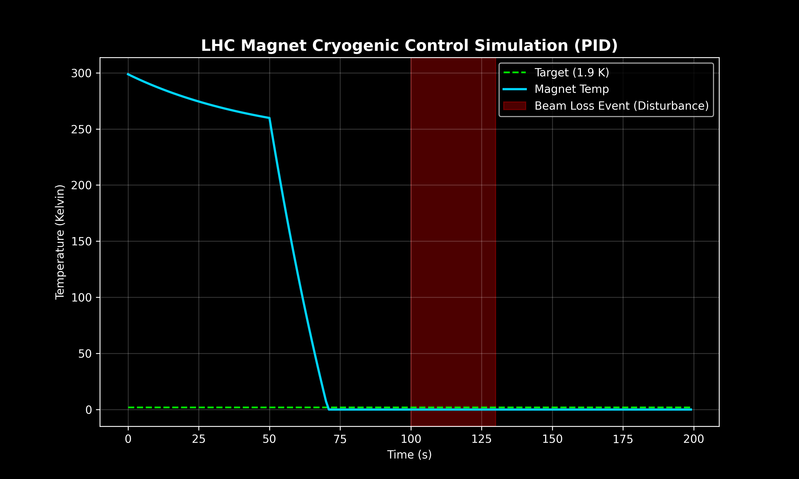

# 🧲 LHC Magnet Cryogenic Control Simulation (PID)


> **A Control Systems Simulation** that models the thermodynamic response of a Large Hadron Collider (LHC) Superconducting Magnet. It implements a custom PID algorithm to maintain critical temperature (1.9 K) despite high-energy beam loss disturbances.

---

## 📉 Visual Evidence
*The graph below demonstrates the controller's ability to reject disturbances (Red Zone) and return the system to steady-state (Green Line).*



---

## 🧠 Scientific Logic
This project explores the **Feedback Control Loops** required for Particle Accelerator instrumentation.

### 1. The Physics Plant (The Magnet)
* **Thermal Inertia:** Modeled using a first-order decay function to simulate the specific heat capacity of the magnet coil mass.
* **Cryogenics:** Simulates the cooling power of Superfluid Helium-4.
* **Disturbance:** Injects random "heat spikes" simulating beam losses (protons hitting the magnet wall).

### 2. The Control Algorithm (PID)
I implemented a manual **Proportional-Integral-Derivative** controller without using "black box" libraries to demonstrate the underlying math:
* **Proportional (Kp):** Reacts instantly to temperature errors.
* **Integral (Ki):** Eliminates steady-state offset errors over time.
* **Derivative (Kd):** Dampens the oscillation to prevent "ringing" (instability).

---

## 🛠️ How to Run
1.  **Clone the Repository:**
    ```bash
    git clone https://github.com/PradyumnShirsath/lhc-cryo-sim.git
    cd lhc-cryo-sim
    ```
2.  **Run the Simulation:**
    ```bash
    python cryo_controller.py
    ```
    *(This will generate the real-time graph seen above)*.

---
*Author: Pradyumn Shirsath | Researching Control Theory & High-Energy Physics Instrumentation*